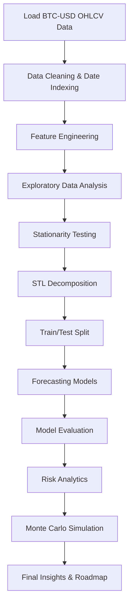

<div align="center">

# ₿ Bitcoin Time Series Analysis & Forecasting

### End-to-end BTC-USD market intelligence project using EDA, stationarity testing, decomposition, forecasting models, risk analytics, and Monte Carlo simulation.

<p>
  
  
  
  
  
  
</p>

<p>
  <b>EDA</b> • <b>Stationarity</b> • <b>STL Decomposition</b> • <b>ARIMA</b> • <b>Holt-Winters</b> • <b>Random Forest</b> • <b>Gradient Boosting</b> • <b>VaR / CVaR</b> • <b>Monte Carlo</b>
</p>

</div>

---

## 📌 Project Overview

**Bitcoin Time Series Analysis & Forecasting** is a professional data science project focused on analyzing historical **BTC-USD daily OHLCV data** and building a complete forecasting and risk-analysis pipeline.

The notebook covers the full workflow from raw market data preparation to advanced financial analytics. It studies Bitcoin price behavior, return distribution, stationarity, trend/seasonality decomposition, forecasting model performance, downside risk, volatility clustering, and 90-day future price simulation.

> ⚠️ **Disclaimer:** This project is created for education, research, and portfolio demonstration only. It is **not financial advice**.

---

## 🎯 Business Problem

Bitcoin is highly volatile, non-linear, and sensitive to market shocks. A simple price chart is not enough to understand its behavior.

This project answers key analytical questions:

- How has Bitcoin behaved across major market cycles?
- Are raw prices stationary, or should transformed returns be used?
- Which forecasting model performs best on unseen BTC price data?
- How large is downside risk based on historical returns?
- What does a probabilistic 90-day future price simulation look like?
- Which engineered features are most useful for short-term BTC price forecasting?

---

## 🗂️ Dataset Description

| Attribute | Details |
|---|---|
| Asset | Bitcoin |
| Symbol | BTC-USD |
| Frequency | Daily |
| Date Range | 2014-09-17 to 2023-12-30 |
| Observations | 3,392 rows |
| Raw Columns | Date, Open, High, Low, Close, Adj Close, Volume |
| Engineered Columns | log_close, log_return, pct_return, daily_range |
| Missing Values | 0 in raw OHLCV columns |

### Close Price Summary

| Metric | Value |
|---|---:|
| Mean Close | $14,574.91 |
| Minimum Close | $178.10 |
| Median Close | $8,244.67 |
| Maximum Close | $67,566.83 |
| Standard Deviation | $16,184.52 |

---

## 🧠 Project Workflow



---

## 📊 Key Analysis Modules

| Module | What It Does |
|---|---|
| Market Overview | Visualizes BTC close price, daily returns, and volume across major cycles. |
| Return Distribution | Studies daily return behavior, fat tails, Q-Q plot, and distribution fit. |
| Stationarity Testing | Uses ADF and KPSS tests to compare raw price, log price, and log returns. |
| ACF / PACF | Analyzes autocorrelation in returns and squared returns. |
| STL Decomposition | Decomposes weekly BTC price into trend, seasonal, and residual components. |
| Forecasting | Benchmarks ARIMA, Holt-Winters, Random Forest, and Gradient Boosting. |
| Risk Analytics | Calculates VaR, CVaR, annualized volatility, Sharpe ratio, and max drawdown. |
| Monte Carlo | Simulates 1,000 possible 90-day future BTC price paths using GBM. |

---

## 🔍 Exploratory Data Analysis Highlights

The EDA section focuses on understanding long-term BTC market structure.

### Major Market Events Annotated

- **2017 bull-market peak** near $20K
- **COVID crash** in March 2020
- **2021 all-time-high cycle** near $69K
- **FTX collapse** in November 2022

### Important Observations

- BTC price series is strongly non-linear and better viewed on a log scale.
- Return distribution shows fat tails and strong deviation from normality.
- Extreme positive and negative daily moves are common compared to traditional equities.
- Bitcoin has experienced deep drawdowns, including a maximum drawdown of approximately **-83.4%**.

---

## 🧪 Stationarity Testing

The project uses both **ADF** and **KPSS** tests for stronger stationarity validation.

| Series | ADF Result | KPSS Result | Final Interpretation |
|---|---|---|---|
| Raw Close Price | Non-stationary | Non-stationary | Not suitable directly for many classical models |
| Log Close Price | Non-stationary | Non-stationary | Still contains trend/unit-root behavior |
| Log Returns | Stationary | Stationary | Suitable for return and risk modeling |

### Key Finding

Raw Bitcoin prices are **non-stationary**, while log returns are **stationary**. This is why the notebook uses log returns for risk analytics and transformed log prices/features for forecasting.

---

## 🧩 STL Decomposition

The project applies **STL decomposition** on weekly BTC prices using:

```python
STL(price_weekly, period=52, robust=True)
```

| Component | Result |
|---|---:|
| Weekly Observations | 485 |
| Trend Range | $223 to $36,049 |
| Seasonal Amplitude | ±$20,096 |
| Residual Standard Deviation | $9,896 |
| Trend Variance Share | 66.5% |
| Seasonal Variance Share | 7.6% |
| Residual Variance Share | 37.2% |

### Why Robust STL?

Bitcoin has extreme jumps and crashes. Robust STL reduces the influence of outliers and produces cleaner trend, seasonal, and residual components.

---

## 🤖 Forecasting Strategy

### Train/Test Split

| Split | Observations | Date Range |
|---|---:|---|
| Training Set | 2,883 | 2014-09-17 to 2022-08-08 |
| Test Set | 509 | 2022-08-09 to 2023-12-30 |

The split is chronological with **no shuffling** to avoid look-ahead bias.

---

## 🛠️ Feature Engineering

The machine learning models use 20 engineered features from log price.

| Feature Type | Examples | Purpose |
|---|---|---|
| Lag Features | lag_1, lag_2, lag_7, lag_30 | Capture short-term and medium-term price memory |
| Rolling Means | ma_7, ma_14, ma_30, ma_60 | Capture smoothed trend behavior |
| Rolling Volatility | std_7, std_14, std_30, std_60 | Capture volatility regimes |
| Momentum | momentum_7, momentum_30 | Capture directional price strength |
| Calendar Features | day_of_week, month | Capture weak calendar effects |

---

## 🧪 Models Used

| Model | Type | Configuration |
|---|---|---|
| ARIMA | Statistical time-series model | ARIMA(1,1,1) on log price |
| Holt-Winters | Exponential smoothing | Additive damped trend |
| Random Forest Regressor | Machine learning ensemble | 200 trees, max_depth=10 |
| Gradient Boosting Regressor | Machine learning ensemble | 300 trees, max_depth=5, learning_rate=0.05 |

---

## 🏆 Model Leaderboard

| Rank | Model | MAPE | MAE | RMSE |
|---:|---|---:|---:|---:|
| 🥇 | Gradient Boosting | **4.78%** | **$1,121** | **$1,372** |
| 🥈 | Random Forest | 5.76% | $1,380 | $1,671 |
| 🥉 | Holt-Winters | 20.71% | $5,485 | $7,012 |
| 4 | ARIMA(1,1,1) | 20.75% | $5,540 | $7,086 |

### Best Model: Gradient Boosting Regressor

Gradient Boosting delivered the best test-set performance with **4.78% MAPE**.

Why it performed best:

- Captures non-linear price behavior.
- Uses lag features effectively.
- Learns interactions between momentum, rolling averages, and volatility.
- Performs well on structured tabular time-series features.

---

## 🔥 Feature Importance Insight

The Random Forest feature-importance analysis showed that the strongest predictor was the previous day's log price.

| Feature | Importance |
|---|---:|
| lag_1 | 0.7456 |
| ma_7 | 0.0756 |
| lag_2 | 0.0588 |
| ma_60 | 0.0290 |
| ma_14 | 0.0254 |
| ma_30 | 0.0190 |

### Interpretation

Bitcoin short-term forecasting is heavily driven by recent price memory. The `lag_1` feature dominates, while rolling averages help capture trend smoothness and regime behavior.

---

## 🛡️ Risk Analytics

| Risk Metric | Value |
|---|---:|
| Daily VaR 95% | -5.76% |
| Daily VaR 99% | -10.39% |
| Daily CVaR 95% | -8.70% |
| Daily CVaR 99% | -13.95% |
| Annualized Volatility | 59.2% |
| CAGR | 62.8% |
| Sharpe Ratio | 0.53 |
| Max Drawdown | -83.4% |
| Best Day | +25.25% |
| Worst Day | -37.17% |
| Excess Kurtosis | 7.58 |

### Key Risk Insight

Bitcoin offers very high long-term growth potential, but the downside risk is extreme. A 95% historical daily VaR of **-5.76%** means the worst 5% of historical days lost more than about 5.76% in one day.

---

## 🎲 Monte Carlo Simulation

The notebook simulates future BTC price paths using a **Geometric Brownian Motion** approach.

### Simulation Setup

| Parameter | Value |
|---|---:|
| Starting Price | $42,156.90 |
| Daily Drift | 0.001334 |
| Annualized Drift | 33.6% |
| Daily Volatility | 0.037278 |
| Annualized Volatility | 59.2% |
| Simulations | 1,000 |
| Forecast Horizon | 90 days |

### 90-Day Simulation Summary

| Outcome | Value |
|---|---:|
| 5th Percentile | $24,412 |
| Median Forecast | $44,921 |
| 95th Percentile | $81,564 |
| Probability Price > Current | 58.5% |
| Probability of 2x | 3.8% |

---

## 📁 Recommended Folder Structure

```bash
bitcoin-time-series-analysis/
│
├── README.md
├── requirements.txt
├── bitcoin_price.csv
├── Bitcoin_Time_Series_Analysis.ipynb
│
├── assets/
│   ├── fig1_market_overview.png
│   ├── fig2_return_distribution.png
│   ├── fig3_stationarity_acf_pacf.png
│   ├── fig4_stl_decomposition.png
│   ├── fig5_model_comparison.png
│   ├── fig6_risk_dashboard.png
│   └── fig7_monte_carlo.png
│
└── reports/
    └── bitcoin_forecasting_summary.pdf
```

---

## ⚙️ How to Run Locally

### 1. Clone the Repository

```bash
git clone https://github.com/your-username/bitcoin-time-series-analysis.git
cd bitcoin-time-series-analysis
```

### 2. Create a Virtual Environment

```bash
python -m venv venv
```

Activate it:

```bash
# Windows
venv\Scripts\activate

# macOS/Linux
source venv/bin/activate
```

### 3. Install Dependencies

```bash
pip install -r requirements.txt
```

Or install manually:

```bash
pip install pandas numpy matplotlib seaborn scipy statsmodels scikit-learn xgboost lightgbm pmdarima jupyter
```

### 4. Launch Jupyter Notebook

```bash
jupyter notebook
```

Open:

```bash
Bitcoin_Time_Series_Analysis.ipynb
```

---

## 📦 Requirements

```txt
pandas
numpy
matplotlib
seaborn
scipy
statsmodels
scikit-learn
xgboost
lightgbm
pmdarima
jupyter
```

---

## 📈 Metrics Explained

| Metric | Meaning | Why It Matters |
|---|---|---|
| MAE | Average absolute prediction error | Easy to interpret in dollars |
| RMSE | Penalizes large errors more strongly | Useful when large forecast misses are costly |
| MAPE | Average percentage error | Good for comparing model accuracy independent of scale |
| VaR | Maximum expected loss at a confidence level | Measures downside risk threshold |
| CVaR | Average loss beyond the VaR threshold | Better measure of tail risk |
| Sharpe Ratio | Return per unit of risk | Measures risk-adjusted performance |
| Max Drawdown | Largest peak-to-trough decline | Shows worst historical capital loss |

---

## 💡 Key Learnings

- Raw crypto prices are usually non-stationary; transformed returns are more useful for statistical modeling.
- Bitcoin returns have fat tails, meaning extreme events happen more often than normal-distribution assumptions suggest.
- Machine learning models with lag and rolling features outperformed classical forecasting models in this notebook.
- Gradient Boosting achieved the strongest forecasting performance with **4.78% MAPE**.
- Risk metrics are essential because good upside performance can hide severe drawdown exposure.
- Monte Carlo simulations provide probabilistic scenarios rather than a single-point prediction.

---

## 🚀 Future Improvements

- Add **walk-forward validation** for more realistic out-of-sample testing.
- Tune hyperparameters using **Optuna** or Bayesian optimization.
- Add **GARCH** models for volatility forecasting.
- Build **LSTM / GRU / Temporal Fusion Transformer** deep learning models.
- Add on-chain metrics such as active addresses, MVRV, NVT, exchange flows, and hash rate.
- Add macroeconomic features such as interest rates, DXY, inflation, Nasdaq, and gold.
- Build a Streamlit dashboard for interactive forecasting and risk analysis.
- Add model explainability using SHAP for ML-based forecasting.

---

## 🧑‍💻 Author

**Akshay Rathod**  
Data Analytics & Data Science Enthusiast

<p>
  <a href="https://github.com/Akshay8087">
    
  </a>
  <a href="https://www.linkedin.com/">
    
  </a>
</p>

---

<div align="center">

### ⭐ If you found this project useful, consider giving it a star on GitHub.

</div>
